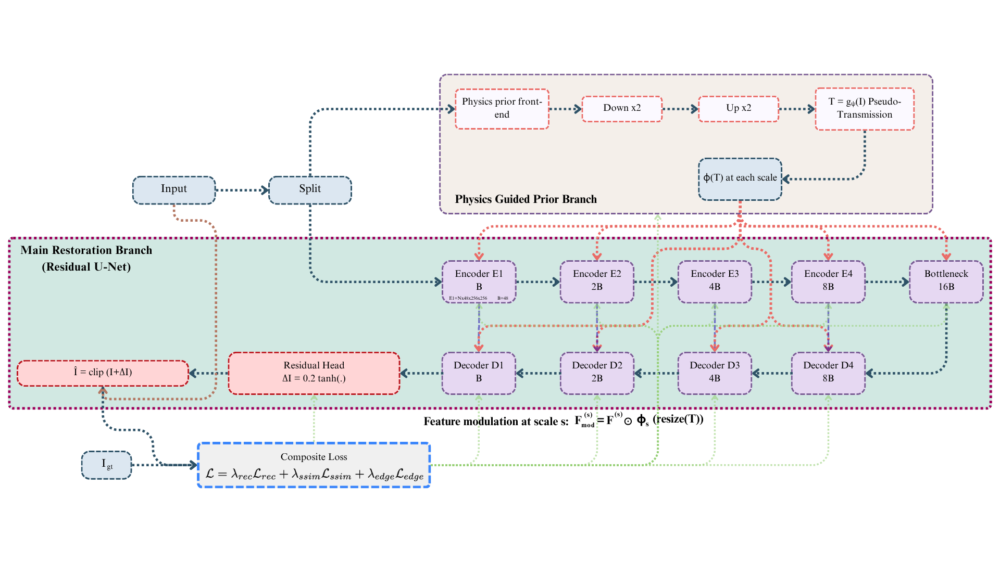

# Underwater Image Enhancement with Learning-Based and Physics-Guided Methods

PyTorch implementation of **Underwater Image Enhancement with Learning-Based and Physics-Guided Methods**, combining a residual U-shaped restoration network with a physics-guided pseudo-transmission prior.

The model performs underwater enhancement as **physics-guided residual restoration** rather than direct full-image generation. A dedicated prior branch estimates a pseudo-transmission map, `T = g_psi(I)`, encoding spatially varying attenuation. For each encoder/decoder scale, transmission is resized and transformed by a learnable mapper `phi_s`, then used to modulate features with element-wise gating, improving degradation-aware correction behavior. The output head predicts a bounded residual and reconstructs the enhanced image through residual addition, preserving scene structure while stabilizing optimization. Training uses a composite objective (reconstruction + SSIM + edge consistency) with mixed-precision optimization for high-resolution efficiency. This design jointly optimizes restoration features and the physics prior pathway through end-to-end backpropagation.



## Highlights

- Multi-scale physics-guided feature modulation: `F_mod^(s) = F^(s) ⊙ phi_s(resize(T))`
- Residual reconstruction head: `DeltaI = 0.2 * tanh(Head(.))`
- Final reconstruction: `I_hat = clip(I + DeltaI, 0, 1)`
- Mixed precision training (`torch.cuda.amp`)
- Composite supervision (Charbonnier/L1 + SSIM + edge)
- PSNR/SSIM evaluation + UCIQE/UIQM proxy reporting


## Training

```bash
python -u /home/zahid/Projects/CVPR/main.py train \
  --paired-degraded "/home/zahid/Projects/CVPR/EUVP/Paired/underwater_scenes/trainA,/home/zahid/Projects/CVPR/EUVP/Paired/underwater_dark/trainA,/home/zahid/Projects/CVPR/EUVP/Paired/underwater_imagenet/trainA" \
  --paired-clean "/home/zahid/Projects/CVPR/EUVP/Paired/underwater_scenes/trainB,/home/zahid/Projects/CVPR/EUVP/Paired/underwater_dark/trainB,/home/zahid/Projects/CVPR/EUVP/Paired/underwater_imagenet/trainB" \
  --val-degraded "/home/zahid/Projects/CVPR/EUVP/test_samples/Inp" \
  --val-clean "/home/zahid/Projects/CVPR/EUVP/test_samples/GTr" \
  --out-dir "/home/zahid/Projects/CVPR/outputs_v3" \
  --epochs 200 --batch 8 --val-batch 4 \
  --crop 256 --val-crop 256 --base 48 \
  --lr 2e-4 --min-lr 1e-6 --weight-decay 1e-4 \
  --w-l1 1.0 --w-ssim 0.3 --w-edge 0.1 \
  --grad-clip 1.0 --workers 4 \
  --val-interval 2 --save-interval 5 \
  --amp --no-tb
```

## Evaluation (paired)

```bash
python -u /home/zahid/Projects/CVPR/main.py eval \
  --val-degraded /home/zahid/Projects/CVPR/EUVP/test_samples/Inp \
  --val-clean /home/zahid/Projects/CVPR/EUVP/test_samples/GTr \
  --checkpoint /home/zahid/Projects/CVPR/outputs_v3/train/<run_id>/ckpt_best.pt \
  --out-dir /home/zahid/Projects/CVPR/outputs_v3 \
  --crop 256 --base 48 --workers 4 \
  --save-images 32 --save-transmission
```

Saved to:

```text
outputs_v3/eval/eval_<timestamp>/
├── metrics.json
├── metrics.csv
└── images/
    ├── *_inp_pred_gt.png  # [input | prediction | ground truth]
    └── *_T.png            # transmission maps (optional)
```

## Inference

```bash
python -u /home/zahid/Projects/CVPR/main.py infer \
  --in-dir /home/zahid/Projects/CVPR/EUVP/test_samples/Inp \
  --out-dir /home/zahid/Projects/CVPR/outputs_v3/infer_samples \
  --checkpoint /home/zahid/Projects/CVPR/outputs_v3/train/<run_id>/ckpt_best.pt \
  --base 48 --save-transmission
```

## Core Hyperparameters (default training profile)

- `base=48`, `crop=256`, `batch=8`
- `lr=2e-4`, `min_lr=1e-6`, `weight_decay=1e-4`
- `w_l1=1.0`, `w_ssim=0.3`, `w_edge=0.1`, `w_nr=0.0`
- `grad_clip=1.0`, `amp=True`


## Citation

```bibtex
@misc{physics_guided_underwater_2026,
  title  = {Underwater Image Enhancement with Learning-Based and Physics-Guided Methods},
  author = {Your Name and Collaborators},
  year   = {2026},
  note   = {Code release}
}
```
